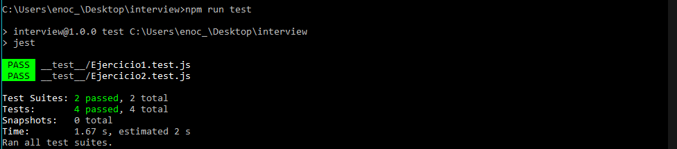

# Prueba Técnica

Resolucion de los ejercicios para la prueba tecnica para el puesto de FullStack Sr

## Instalacion
Para instalar las dependencias solo hace hace falta correr el siguiente comando

```bash
npm install
```
## Correr pruebas
Para correr las pruebas solo se necesita correr el siguiente comando
```bash
npm run test
```



